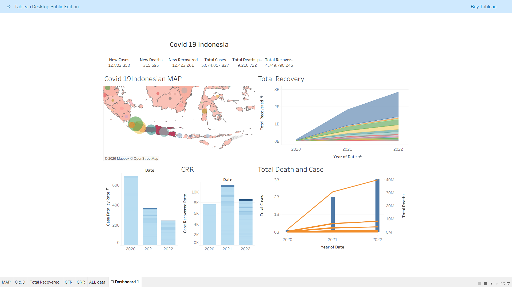

# COVID-19 Indonesia Dashboard (Tableau)

## Overview

This project presents an interactive dashboard built using Tableau to analyze the spread and impact of COVID-19 in Indonesia.

The dashboard provides a comprehensive view of cases, deaths, recoveries, and key health indicators across different regions and time periods.

---

## Objectives

* Monitor COVID-19 trends in Indonesia
* Analyze total cases, deaths, and recoveries
* Evaluate key metrics such as Case Fatality Rate (CFR) and Case Recovery Rate (CRR)
* Visualize geographic distribution of cases

---

## Key Features

* **KPI Metrics**

  * New Cases
  * New Deaths
  * New Recoveries
  * Total Cases
  * Total Deaths
  * Total Recoveries

* **Visualizations**

  * Indonesia map showing case distribution by region
  * Total recovery trends over time
  * Comparison of total cases and deaths
  * Case Fatality Rate (CFR) analysis
  * Case Recovery Rate (CRR) analysis

---

##  Insights

* Significant increase in total cases between 2020 and 2022
* Recovery trends show steady growth over time
* CFR decreases over time, indicating improved handling of cases
* Certain regions contribute more significantly to total cases

---

## Tools Used

* Tableau (Dashboard & Visualization)
* Dataset COVID-19 Indonesia (CSV/Excel)

---

## Project Structure

```id="c19dash"
├── dataset/
│   └── covid_indonesia.csv
├── dashboard/
│   └── covid_dashboard.twbx
├── images/
│   └── dashboard_preview.png
└── README.md
```

---

## How to Use

1. Download the `.twbx` file
2. Open using Tableau Desktop / Tableau Public
3. Explore the dashboard interactively

---

## Preview



---

## Future Improvements

* Add real-time data integration
* Include vaccination analysis
* Enhance interactivity with more filters

---

## Author

This project is part of a data visualization portfolio showcasing skills in data analysis and dashboard development.
